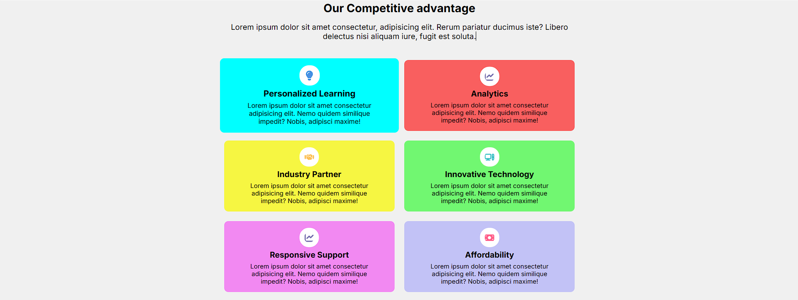

# Learners Hub

## Overview

Learners Hub is a responsive website designed using HTML and CSS.
It features a clean, modern design with sections for navigation, hero content, testimonials, and a newsletter signup.
The website is optimized for different screen sizes and provides a smooth user experience.

## Features
- **Responsive Design**: Works across different screen sizes with media queries.
- **Navigation Bar**: Includes links to Home, Features, Pricing, Blog, and About sections.
- **Hero Section**: Engaging introduction with a call-to-action.
- **Trusted by Section**: Displays logos of companies that trust the platform.
- **Features Grid**: Highlights the key offerings of Learners Hub.
- **Testimonials**: Showcases user feedback in an interactive manner.
- **Newsletter Subscription**: Allows users to subscribe for updates.
- **Footer Section**: Provides useful links and social media icons.

## Technologies Used
- **HTML5**: Structuring the web pages.
- **CSS3**: Styling and responsiveness using media queries.
- **Google Fonts**: Enhancing typography with the Inter font.

## Folder Structure
Learners-Hub/

│── index.html    # Main HTML file  
│── style.css     # Styling file  
│── Images/       # Directory containing images used in the project

## Future Enhancements
- Can add JavaScript for interactive elements.
- Improve accessibility features.
- Implement a backend for form handling.

## How to Use
1. Clone or download the repository.
2. Open the `index.html` file in a browser.
3. Explore the different sections and functionalities.

## Screenshots

